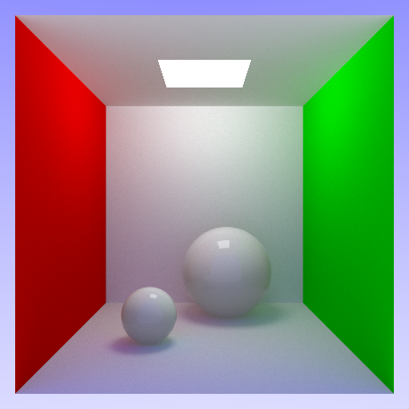

# Rayrs

A project for learning Rust.

Rayrs does backward tracing of rays to achieve an unbiased image. It takes
inspiration from https://raytracing.github.io and https://www.pbr-book.org/
as well as other sources.

Example output at 10000 samples per pixel:  

